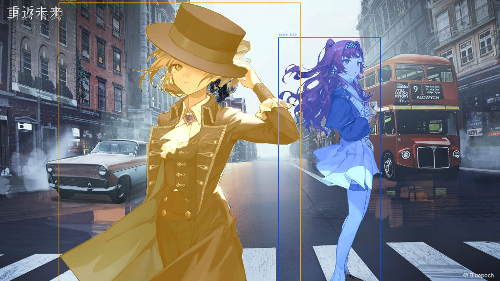
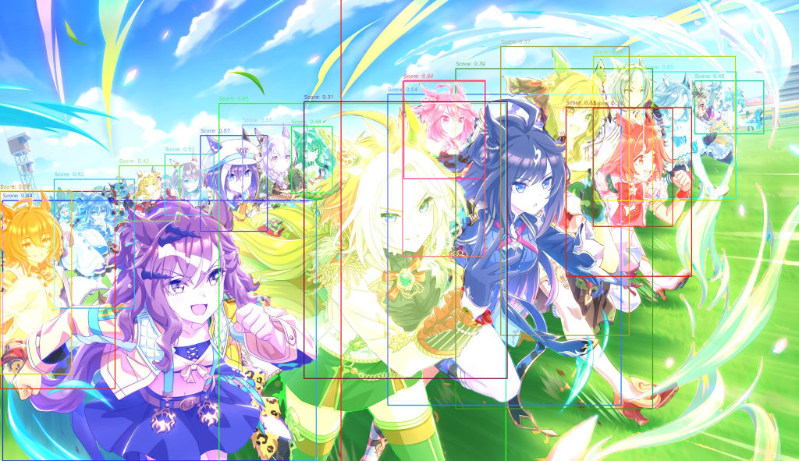

# CartoonSegmentationOnnx-Colaboratory-Sample
Colaboratory上で[jakaline-dev/CartoonSegmentationOnnx](https://github.com/jakaline-dev/CartoonSegmentationOnnx)をお試しするサンプルです。 

 
Colaboratoryでノートブックを開き、上から順に実行してください。

# CartoonSegmentationOnnx

[Original project link](https://github.com/CartoonSegmentation/CartoonSegmentation)

Get the converted onnx models from [Huggingface](https://huggingface.co/Jakaline/CartoonSegmentationOnnx), and add to /models directory.

Jupyter notebook demo included.

## Demo

## Remarks

Can fail if multiple subjects overlap each other, or if the image ratio is too big/small.
